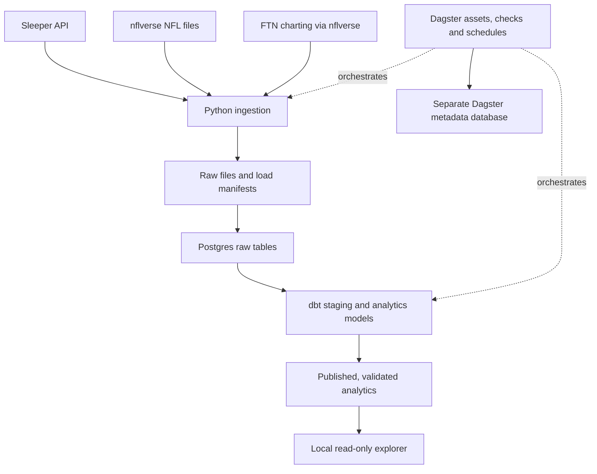

# League Lab — MVP1 implementation plan

Version 1.0 · 2026-09-15 · Owner: Andrew

This document is the implementation and continuation contract. It defines planned work; it does not claim that the database, pipeline, repository, or explorer has been built. The accompanying [setup runbook](SETUP_RUNBOOK.md), [interactive checklist](MVP1_CHECKLIST.html), [Markdown checklist](MVP1_CHECKLIST.md), and [task manifest](MVP1_TASKS.json) use the same task IDs.

## 1. Outcome and scope

Build a reproducible local analytics platform for Andrew's Sleeper league and NFL skill-position research. MVP1 delivers reliable historical data, transparent opportunity/context metrics, a local receiver explorer, and descriptive league/kicker comparisons. The foundation must support later forecasting without asserting that descriptive correlations already predict performance.

**Positions:** QB, RB, WR, TE, K. Team defense remains available for league scoring and opponent context; individual-defense prediction is excluded.

**History:** 2016–2025 completed NFL seasons, with 2026 season-to-date stored separately. Regular season and postseason are explicitly labeled; regular season is the default view. NFL season year is not calendar year. Advanced sources retain their actual shorter coverage.

**League:** Sleeper ID `1389709692405551104`, League of Scrubs. The September 5 inspection found 10 teams, half-PPR, two flex slots, and a historical chain through 2025 (`1256450429399617536`) and 2024 (`1112705311674097664`). A 2025 matchup contained both starter and player points. Re-fetch these facts before ingestion; draft-era rosters/status are stale. Andrew's own roster ID remains unknown and does not block NFL imports.

**Worked examples:**

- Murray/Jefferson: Murray's historical passing volume and leading-receiver outcomes, Jefferson's usage across quarterbacks, with current team context re-verified when the brief is written.
- Washington: compare 2025 early-season, expanded-role, and late-season opportunity; isolate partial/injury-affected games and playoffs. Show whether changes came from team volume, participation, target earning, depth, YAC, or touchdowns.
- Kicker streaming: compare actual started points in common eligible weeks, variability, changes and acquisitions/cost. MVP1 reports realized outcomes. Reconstructed waiver availability, simulated alternatives, and causal claims about streaming are later work.

**Outside MVP1:** public hosting, authentication/multi-user access, AWS/Redshift, live scoring, automated roster moves, paid-feed integration, production-trained player forecasts, a full draft optimizer, and ten-year route/first-read data that the sources do not actually provide. A paid routes feed must not block the free MVP.

## 2. Current environment and decisions

Observed September 15, 2026: Apple Silicon Mac, Homebrew and Git available; Python 3.14.6 installed; PostgreSQL 17.11 binaries and the default Homebrew PG17 cluster are present. No server answered at localhost:5432 or the default socket. Homebrew reported the service unregistered; its metadata refresh encountered a cache permission error, so recheck service state during setup. Approximately 713 GB was free. uv, dbt, Dagster, and GitHub CLI were not on this session's PATH; this is not an exhaustive inventory of every Python environment.

| Decision | MVP1 choice | Reason |
|---|---|---|
| Database | Reuse native PostgreSQL 17 | Already installed; no container runtime needed |
| Python | Project-specific Python 3.13, managed by uv | Current dagster-dbt metadata excludes 3.14; leave system Python unchanged |
| Transformations | dbt Core + dbt-postgres | Tested SQL models and documented metrics |
| Orchestration | Local Dagster OSS | Asset lineage, bounded backfills, checks and schedules |
| Raw storage | Source Parquet and compressed JSON on disk | Replayable original data without excessive database duplication |
| Interface | Local read-only Streamlit explorer | A small Python interface fits this analytical MVP |
| Source control | Local Git; private GitHub remote | Source/configuration and agent handoffs, excluding data/secrets |
| Concurrency | One pipeline writer initially | Avoid conflicting partition replacements and dbt builds |
| Spend | Free public data and existing hardware | No cloud bill or paid data commitment required |

Dependency versions must be resolved and tested together, then committed in `uv.lock`. The version candidates in the runbook are verified from package metadata, not a lockfile already tested on this machine.

## 3. Architecture



One existing PostgreSQL server hosts `league_lab` and `dagster_meta`. Use distinct pipeline, application-read, and orchestration roles. The explorer reads only approved analytics models. Keep services bound to localhost. Dagster metadata is not an analytics dataset.

Proposed repository layout:

```text
league-lab/
  AGENTS.md
  README.md
  pyproject.toml
  uv.lock
  .python-version
  .env.example
  .gitignore
  config/dbt/profiles.yml
  config/sources.yml
  src/league_lab/             # ingestion, identity, scoring, Dagster definitions
  dbt/                       # staging, intermediate models, marts, tests, macros
  app/                       # read-only explorer
  tests/fixtures/            # tiny synthetic or explicitly shareable fixtures
  scripts/                   # validated setup, refresh and backup entrypoints
  docs/                      # plan, metrics, source contracts, STATUS.md, runbook
  data/raw/                  # ignored; source/season/run snapshots
  .state/dagster/             # ignored; persistent DAGSTER_HOME
  backups/                   # ignored; local backup staging
```

`league_lab` is the Python module and analytics database name throughout this plan. Physical paths are configured once; defaults must not hardcode an agent's working directory. Store credentials in an ignored `.env` or approved local secret mechanism. Check in only placeholders. Never commit full player dumps, raw data, database files, local run logs, or backups.

## 4. Source contracts and coverage

| Source | Required content | Initial coverage / behavior |
|---|---|---|
| Sleeper | League settings/scoring, members, rosters, weekly matchups, transactions, drafts/picks, player metadata | Traverse the actual linked league history; the observed chain begins in 2024. Store large IDs as text. API is read-only and token-free. Cache the full player directory at most daily. |
| NFL reference | Games/schedules, player identity crosswalk, historical rosters | 2016 onward; canonical NFL/GSIS IDs with explicit Sleeper mapping. Never join by name alone. |
| NFL player/team statistics | Game-level passing, rushing, receiving, kicking | 2016 onward where supplied; authoritative reconciliation source. Verify exact loader schema during the pilot. |
| NFL play-by-play | Pre-play situation, play outcome and involved players | 2016 onward; retain original events and flags before analytical exclusions. |
| Snap counts | Player-game offensive snaps and snap percentage | 2016 onward where coverage verifies; not a route count. |
| Participation | On-field player lists and personnel | Historical availability/joins must be audited. From 2023 onward the published participation feed arrives after the postseason, not during the live season. |
| FTN charting subset | `read_thrown`, motion, play action, RPO and other documented fields | Available from 2022; strict first-read coding starts in 2023. Its charting feed has an in-season update schedule distinct from participation. |
| Route counts | Player-game routes and provider definition | Optional future import. Missing until a verified source is supplied. No fabricated denominator from snaps or targets. |

Primary references: [Sleeper API](https://docs.sleeper.com/), [nflreadpy loaders](https://nflreadpy.nflverse.com/api/load_functions/), [player ID crosswalk](https://nflreadr.nflverse.com/reference/load_ff_playerids.html), [nflverse availability](https://nflreadr.nflverse.com/articles/nflverse_data_schedule.html), [participation dictionary](https://nflreadr.nflverse.com/articles/dictionary_participation.html).

FTN's public charting subset is distributed under CC-BY-SA 4.0 with attribution to **FTN Data via nflverse**. Preserve source/license metadata and attribution in relevant exports and views. Check source-specific terms before any future public data distribution; a private repository does not itself grant redistribution rights. [FTN loader and license](https://nflreadr.nflverse.com/reference/load_ftn_charting.html)

Every source partition records source URL, source-provided update time when present, fetch time, season/game scope, checksum, schema fingerprint, row count, load status and code version. A successful HTTP response with missing columns or an empty unexpected dataset is a failed contract check.

## 5. Canonical data model

| Model | Grain / key | Important contract |
|---|---|---|
| `dim_player`, `player_id_map` | Canonical player; provider/ID mapping | Identity persists across trades and position changes; ambiguous IDs are quarantined. |
| `dim_game` | NFL `game_id` | Season, season type, week, kickoff, teams and game status. Week alone is never the key. |
| `player_team_history` | Player and validity interval/game | Historical affiliation, not today's team copied backward. |
| `fct_play` | Canonical `game_id`, `play_id` | Verify source uniqueness; map FTN play keys explicitly. Pre-play score is from the offense's perspective. |
| `bridge_play_actor` | Play, player, role | Passer, rusher, targeted receiver, kicker, etc. Actor identity does not establish all on-field players. |
| `bridge_play_participation` | Play, player | On-field presence from the participation source. Absent source data means unknown. |
| `fct_team_game` | Team, game | Independent team totals and opportunity denominators. |
| `fct_player_game` | Player, game | Passing/rushing/receiving/kicking, appearance evidence, historical position/team; multiple statistical roles may coexist. |
| `fct_play_charting` | Source, game, play | Raw and normalized read categories, join status, source/version; never multiply plays after enrichment. |
| `mart_player_season` | Player, season, season type | Aggregate numerators and denominators, then calculate rates. Team splits are a separate dimension/view. |
| `mart_player_context` | Player, game, situation bucket | Counts/rates by half, pre-play score and other defined context. |
| `league_player_week` | League-season, week, roster, player | Actual lineup membership, starter flag and observed points; retain commissioner overrides separately. |
| `ops_load_manifest`, `ops_publication` | Load or publication ID | Successful source partitions and the last validated analytics publication. |

Expose QB/RB/WR/TE/K game and season views from shared facts. Do not calculate team totals by summing duplicated participant rows. Preserve original statistics separately from fantasy points. Apply the historical league scoring version for league history and a clearly labeled current-scoring view for cross-year research.

## 6. Metric contract, including first reads

### First-read target share

Use FTN charting joined to play-by-play by game and play IDs. The targeted receiver and offensive team come from play-by-play. Our strict metric is:

`player counted targets labeled first read / team counted targets labeled first read`

FTN's `read_thrown = "0"` is first read from 2023 onward; `"1"`, `"2"`, `"CHK"`, `"DES"`, and `"SD"` represent other progression/design categories. Keep designed throws separate. Missing 2022 first-read labels stay unknown. [Field definition](https://nflreadr.nflverse.com/articles/dictionary_ftn_charting.html)

For player-season displays, default to the player's verified appearance games, grouped by historical offensive team; offer an explicitly labeled all-team-games view. Game and context filters must apply identically to numerator and denominator. Do not filter the denominator down to the selected receiver. Other positions' targets remain in the team denominator.

Store first-read count, team first-read count, eligible target count, classified-target count, join/coverage rate and metric version. Zero denominator produces NULL. Use eligible targeted pass attempts with identified receivers, including incompletions and interceptions; define nullified-play, throwaway and two-point exclusions in the metric registry. Display values as 'charted targets' and warn when coverage is incomplete; coverage is never repaired by assuming missing means first read. Pilot checks determine source-specific coverage thresholds before publication.

This measures where first-read **throws** went. It does not identify the initial intended receiver on every sack, scramble, or later-read throw. It is also different from 'fraction of this receiver's targets that were first reads' and 'first-read targets per route.' Those need distinct names and denominators. Publish any optional first-or-designed version separately.

### Other MVP1 metrics

- Volume: targets, receptions, carries, passing attempts/dropbacks, air yards, red-zone targets/carries, kicking attempts by distance, game appearances and observed fantasy points.
- Usage: target share, carry share, offensive snap share, air-yard share, first-read target share, recent 3/5-game versus season windows. Air-yard share can be negative or exceed 100% when signed air-yard denominators behave that way; flag unstable denominators instead of applying a generic 0–100% test.
- Efficiency: completion rate, yards per attempt/target, average target depth, YAC per reception. Routes, TPRR and YPRR remain nullable until actual route counts are available.
- Context: first/second half with separate overtime, leading/tied/trailing, score margin, clock, down/distance, field position, QB on the play, and team passing opportunities.
- Score buckets: trailing by 9+, trailing by 1–8, tied, leading by 1–8, leading by 9+. Retain raw score and clock so this reporting choice is reversible. Never assign pre-play context from final score.

Dropbacks include attempts, sacks and scrambles. Kneels, spikes, two-point tries, penalties and no-play records require metric-specific eligibility flags. Keep original events. Participation measures presence; it does not prove that the coach rested someone. An apparent game-script effect is an association until investigated more carefully. [Play field definitions](https://nflfastr.com/reference/fast_scraper.html)

## 7. Ingestion, backfill and refresh

Start with a complete **2025 pilot**, plus the Sleeper history and available FTN charting. Validate the joins, scoring and refresh behavior before backfilling 2016–2025. Keep a source-by-season coverage inventory and explicit unsupported partitions. The 2026 active season is a separate recurring workload.

Bulk source files are partitioned by source and season. Sleeper is partitioned by league-season and endpoint/week where applicable. Avoid downloading the same full-season file once per game. Use conditional requests when supported; compare content hashes before loading. Save atomically, validate, then transactionally replace/upsert the affected source partition. Keep one writer and bounded memory; do not pass full play-by-play frames through default Dagster object storage.

Use Dagster assets for acquisition, load checks, dbt source dependencies, transformations and publication. Map dbt source asset keys to Python-loaded tables. Required source/check failures block dependent models. Optional FTN lateness can publish a clearly marked core-data update without replacing a previous advanced metric with zero.

**Publication contract:** an explorer refresh sees a complete validated build. Build marts under a build-specific schema; run tests there; then transactionally repoint stable `analytics` views and update `ops_publication`. Grant the app access to the approved marts in that immutable publication only after validation. Pin one successful publication/schema for every query in a page render, so a mid-render swap cannot mix results. Retain previous publications for active readers (initially at least 24 hours) and preserve the last good publication after a failed build. dbt alone does not make a whole project run atomic. Reject a build whose target schema is the stable `analytics` schema.

### Proposed America/New_York schedule

| Job | Schedule | Scope |
|---|---|---|
| League refresh | Daily 07:00 and manual refresh | Current league settings/rosters/transactions/matchups; cache full player directory once daily. |
| NFL core + charting | Daily 08:00 in season | Current-season source files; process changed content and rebuild affected games/marts. |
| Correction reconciliation | Thursday 10:00 | Re-read current-season statistics and recent four NFL weeks of league matchups; include earlier games when a changed season file indicates revisions. |
| Historical audit | Monthly, on demand initially | Compare historical source checksums; explicitly rebuild changed partitions. |
| Backup | After successful daily publication, with a weekly retained copy | Database dumps plus metadata/config inventory; copy to Andrew's selected destination. |

Charting may arrive after core stats; the FTN loader documents a roughly 48-hour charting window. Recheck pending games and display source-specific freshness. Participation is a different feed with postseason timing. Schedules do not guarantee upstream publication times. [FTN timing](https://nflreadr.nflverse.com/reference/load_ftn_charting.html), [nflverse timing and corrections](https://nflreadr.nflverse.com/articles/nflverse_data_schedule.html)

Persist `DAGSTER_HOME` and use Postgres metadata storage. `dagster dev` starts a webserver and daemon; do not start a duplicate daemon. Local execution requires the Mac to be awake, the processes running, and network access for downloads. On startup, reconcile expected completed games/source partitions against the last successful load and enqueue stale/missing partitions. Do not rely on automatic replay of every missed schedule tick. Manual refresh is a first-class operation.

Use exponential retry with limits for transient network errors and rate limiting. Surface schema changes, identity mismatches and missing required files as actionable failures. Do not retry bad data indefinitely. Make run history, row counts, last success and error summaries visible in Dagster and the explorer's data-status page.

## 8. MVP interface

The local explorer provides:

1. Player/position, season, week window and REG/POST filters; game and season tables.
2. Receiver comparison and early/late window views, including first-read target share with counts and coverage.
3. Half and pre-play score-state breakdowns showing team dropbacks alongside player targets/participation, with unavailable routes explicitly labeled.
4. Saved Murray/Jefferson and Washington research views, with reproducible query parameters.
5. Basic positional views and a league/kicker overview.
6. Data status: through-game dates, successful publication time, pending charting, source coverage and validation failures.

Use a read-only role, parameterized database queries and cached results keyed to publication ID. Get the current accepted publication through a read-only metadata view, then query that immutable publication's approved marts for the whole render. Treat schema identifiers as validated server-owned values, never user SQL. The page must not perform fresh upstream ingestion on every rerun. Bind to `127.0.0.1`; public sharing is a separate iteration. A local interface is not dependent on a hosted website provider.

## 9. Quality and acceptance

MVP1 is done only when all of these are demonstrated:

- A fresh checkout can follow the runbook and `uv sync --locked`; secrets remain local.
- The pilot and full history have unique keys, audited identity joins, source coverage and reproducible load manifests.
- Replaying a successful partition leaves counts and values unchanged; a failed/incomplete download preserves prior good data.
- A stratified sample across all five positions reconciles with published NFL statistics; at least two Sleeper weeks across historical seasons reconcile starter totals and any overrides.
- Rates use correct shared windows and denominators; joins do not inflate volume. Tests cover a trade, bye/inactive/zero-stat distinction, overtime, sack/scramble, nullified event and zero/missing denominator.
- First-read output is unavailable for unsupported seasons, designed throws stay separate, and incomplete charting is visible. Sample counted plays reconcile to a manually inspected first-read calculation.
- The explorer demonstrates both worked questions and a league/kicker comparison, with no claim that unknown advanced metrics equal zero.
- A successful publication survives a subsequent failed build. A publication swap during page rendering does not mix versions. Database read access cannot mutate analytics.
- Dagster run history survives restart; a simulated missed-refresh interval is recovered without duplicates; only one writer runs.
- A backup restores into a separate test database and passes sample row-count/data checks.
- Andrew reviews the examples and accepts the result; remaining limitations and next priorities are recorded.

Performance is measured on this Mac, not promised in advance. Target common filtered explorer queries under two seconds after warmup. If necessary, index game/player keys and materialize summaries before changing platforms. Measure source files, indexes, PostgreSQL data and backups separately; 100 GB is a planning ceiling, not a reservation. Alert at 50 GB project footprint and investigate before approaching 80 GB.

## 10. Sequence and parallel agent handoff

The 33 tasks in the manifest are the execution backlog. Andrew owns seven decisions/reviews; an agent can perform the technical work. The initial completed item is preflight only. Owner does not imply that software is already installed/configured.

Critical path: repository location → local environment → contracts and pilot ingestion → canonical models → validation → publication/explorer → refresh/recovery → full acceptance. GitHub authentication and personal roster identification can proceed alongside local NFL work. Full backfill starts after the pilot passes.

| Worker | Task IDs | Owned area | Inputs / boundary |
|---|---|---|---|
| Environment integrator | E01–E06 | project config, roles, dbt profile, instance config | Andrew's folder/repo decisions; owns shared dependency/config changes |
| Ingestion agent | D01–D06 | loaders, source contracts, manifests | Approved keys/contracts; does not change metric definitions alone |
| Modeling agent | M01–M05 | dbt, metric registry, scoring tests | Pilot tables and identity mapping; source-specific gaps remain explicit |
| Operations agent | O01–O05, H01 | schedules, recovery, backup docs | Stable asset/model contract; user-owned O03/O05 remain Andrew decisions |
| Interface/research agent | U01–U04 | explorer and saved research briefs | Validated analytics contract; user-owned U04 remains Andrew review |
| Integrator / reviewer | H02–H03 | merge and acceptance evidence | User-owned H03 is Andrew's final acceptance |

These are workstreams, not permission to run every task simultaneously. Parallelize only after required schemas and interfaces are agreed. Use separate branches/worktrees; one integration owner merges, manages dependencies, and runs database-writing tests. Give each worker a scratch schema or synthetic fixtures. Never let two agents independently rename shared models, update `uv.lock`, or migrate the same database.

Every handoff includes: task ID, relevant plan sections, branch/commit, exact files changed, input/output schema, commands executed, validation evidence, data partitions touched, unresolved limitations and next task. `docs/STATUS.md` records current commit, tool versions, database/ports, last successful publication, source freshness, task states, source-license notes and the next concrete action. Do not put secrets in handoffs.

Suggested continuation prompt:

> Read AGENTS.md, docs/MVP1_PLAN.md, docs/SETUP_RUNBOOK.md, docs/STATUS.md and the assigned task's dependencies. Implement task ID __ only within the agreed contract. Verify current environment/source schemas before mutation. Preserve other workers' changes and existing data. Report changed files, tests, evidence, unresolved issues and next steps; update STATUS.md through the integration owner. Do not expand scope or claim completion without the acceptance evidence.

## 11. Later iterations

MVP2 can evaluate time-valid predictive baselines: recent usage versus season-to-date, projected team volume and receiver opportunity, and next-season WR1 outcomes with chronological holdouts. Use season-relative baselines and compare simple models before adding complexity. A latest-corrected historical dataset alone is not a point-in-time archive; begin snapshotting now and label retrospective limitations.

Later independent choices: licensed routes/charting, additional injury/lineup inputs, waiver-availability reconstruction, public hosting, always-on scheduling, and an AWS/Redshift learning branch. Move those choices forward only when the MVP reveals a concrete need.
